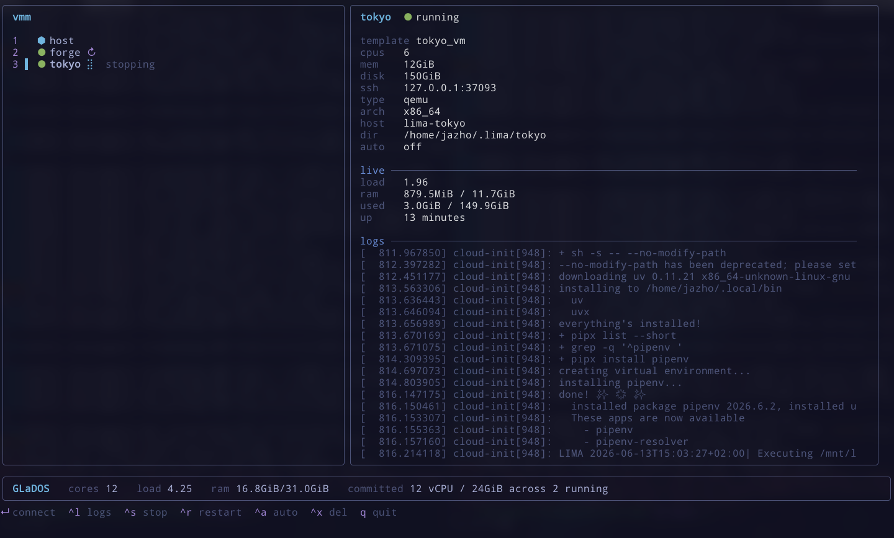

# uplink

A launcher for the shells you work in: your own host, isolated development VMs on
top of [Lima](https://lima-vm.io/), and ssh remotes. One hotkey, one list, one
keystroke to be inside any of them.

Each target carries named launch modes, so the same machine can be a tmux session,
a plain shell, or a one-off program depending on which you pick. VMs additionally
get a full lifecycle: created from a template, started, stopped, and deleted from
the dashboard.



## Requirements

- Linux (the prebuilt binary is `linux/amd64`)
- [Lima](https://lima-vm.io/) (`limactl` on your `PATH`)
- `git`
- Optional, for global keybindings: GNOME and [Alacritty](https://alacritty.org/)

## Install

```sh
curl -fsSL https://raw.githubusercontent.com/jazho76/uplink/main/scripts/install.sh | sh
```

This drops `uplink` in `~/.local/bin`. If that is not on your `PATH`:

```sh
export PATH="$HOME/.local/bin:$PATH"
```

Keep it current with `uplink upgrade`.

## Quick start

```sh
# 1. Add a template (a git repo that defines a VM). Its name is the repo basename.
uplink vm template add git@github.com:you/your_vm.git

# 2. Create one or more instances from it. The name defaults to the template's.
uplink vm create your_vm              # instance "your_vm"
uplink vm create your_vm your_vm-2    # a second instance from the same template

# 3. Open a shell on any target, starting it if stopped.
uplink your_vm                        # or: uplink connect your_vm
uplink your_vm:shell                  # a specific launch mode
uplink host                           # your own machine

# 4. Browse and control every target interactively.
uplink                                # or: uplink dashboard
```

## Concepts

- **Target** - anything you can open a shell on. Your host, a Lima VM, and
  (declared in config) an ssh remote. Each has a name you connect to.
- **Mode** - one way to launch a target: a name plus a shell payload. Each
  provider wraps that payload in its own transport, and a mode with no payload
  lands you in that transport's plain interactive shell. Targets ship with a
  `tmux` and a `shell` mode by default.
- **Template** - a git repo containing a `template.yaml` (the Lima config),
  plus `dotfiles/` and `provision/` scripts. Templates live in
  `~/.local/share/vmm/templates/<name>`, where `<name>` is the repo basename.
  A template is a recipe; you launch instances from it.
- **Instance** - a Lima VM created from a template. One template can produce
  many instances under different names; each instance remembers the template it
  came from (Lima persists its `TemplateDir`).

## Config

Optional, at `~/.config/uplink/config.yaml`. Every section can be omitted, in
which case that provider falls back to its built-in defaults. `uplink config
edit` opens it and checks it afterwards; `uplink config check` prints every
target with the exact command each of its modes runs.

```yaml
local:
  modes:
    - { name: tmux, run: tmux new-session -A -s host }
    - { name: shell } # no payload = a plain interactive shell
    - { name: top, run: htop, back: true }

lima:
  modes:
    - { name: tmux, run: tmux new-session -A -s 0 }
    - { name: shell }

remotes:
  - name: dojo
    ssh: joe@dojo.com
    identity: ~/.ssh/dojo # relative paths resolve against this file's dir
    init: lc # runs first, joined to each mode with &&
    modes:
      - { name: tmux, run: tmux }
      - { name: shell }
      - { name: root, run: sudo env HOME=/home/joe tmux }
```

The first mode listed is the default. `back: true` returns to the dashboard when
the program exits instead of closing the window, which suits a quick look at
`htop` rather than a shell you intend to live in. A broken config never locks you
out: uplink falls back to defaults and shows the problem in the status line.

## Connecting

```sh
uplink <target>                    # default mode
uplink <target>:<mode>             # a named mode
uplink connect <target> --mode <mode>
```

## Remotes

`remotes` is the only section that declares what exists, since there is nothing to
discover. Every field but `name` is optional: with no `ssh` the name doubles as the
destination, so a `Host` block in `~/.ssh/config` can carry the rest.

| Field      | Meaning                                                               |
| ---------- | --------------------------------------------------------------------- |
| `name`     | how you address it, and the ssh destination if `ssh` is omitted       |
| `ssh`      | ssh destination, `user@host` or a `Host` alias                        |
| `identity` | key path; implies `IdentitiesOnly=yes` so the agent cannot preempt it |
| `port`     | ssh port                                                              |
| `sshArgs`  | extra ssh flags, verbatim                                             |
| `shell`    | login shell used to run `init` and payloads, `bash` by default        |
| `init`     | runs first in the login shell, `&&`-joined to every mode's payload    |

A remote's status stays `unknown` until you select it in the dashboard, at which
point it is probed once and shows either live counters or `unreachable`. Nothing
is probed in the background, so uplink never reaches out to a host you are not
looking at. A key that is missing or has permissions ssh would reject shows up as
a warning on the target rather than as a failure at launch.

## Managing VMs

```sh
uplink vm create <template> [instance]   # create and provision an instance from a template
uplink vm push-clipboard [instance]      # copy the host clipboard into an instance
uplink vm refresh-externals <instance>   # re-fetch and re-apply the instance's externals

uplink vm template add <git-url>         # clone a template into the templates dir (name = repo basename)
uplink vm template list                  # show installed templates, origins, dirty state
uplink vm template update [name]         # pull the latest version, fast-forward only (all if no name)
uplink vm template remove <name>         # delete it (use --force to skip the prompt)
```

`uplink vm create` is how you spin up an instance; the name defaults to the
template's, and you pass a second argument to run more than one from the same
template. Starting, stopping, restarting, autostart, and deletion live in the
dashboard rather than the CLI.

## Dashboard

`uplink` bare, or `uplink dashboard`, is the interactive hub: a two-pane TUI over
every target. It reads Lima directly, so instances created outside uplink show up
too.

| Key               | Action                         |
| ----------------- | ------------------------------ |
| `↑`/`k` `↓`/`j`   | move                           |
| `1`-`9`           | connect to that target         |
| `Enter`           | connect the selected target    |
| `Tab`/`Shift-Tab` | cycle the selected launch mode |
| `Ctrl-L`          | view logs                      |
| `Ctrl-S`          | stop                           |
| `Ctrl-R`          | restart                        |
| `Ctrl-A`          | toggle autostart               |
| `Ctrl-X`          | delete                         |
| `q` / `Esc`       | quit                           |

Keys appear only where they apply: a target whose provider has no lifecycle shows
no stop, restart, or delete. Cycling a mode with `Tab` affects only the selected
row, and resets as soon as you move the cursor.

## Launcher

On a GNOME session, register global keybindings so uplink behaves like a native
app launcher: one hotkey pops the dashboard in an Alacritty window, no terminal
needed.

```sh
uplink install-shortcuts     # Ctrl+Alt+T opens the dashboard, Ctrl+Alt+P pushes the clipboard
uplink uninstall-shortcuts
```

## Authoring a template

A template is a git repo with this shape:

```
template.yaml        # Lima config; declares `param: TemplateDir` and mounts
                     # host paths as {{.Param.TemplateDir}}/dotfiles, etc.
dotfiles/            # mounted read-only into the guest
provision/           # provisioning scripts referenced by template.yaml
fetch-externals.sh   # optional: host-side step to pull externals before create
```

## From source

```sh
make install     # build and install to $GOBIN (or $(go env GOPATH)/bin)
make uninstall   # remove it
```
