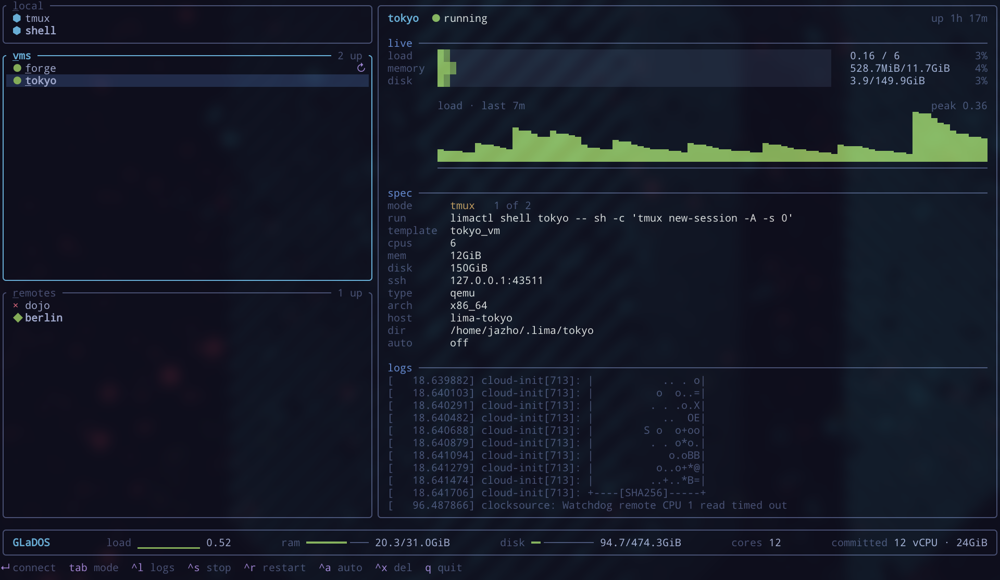

# Uplink

**One shortcut. Every machine. The same tmux-native workflow everywhere.**

Uplink is the launcher I use to move between my local host, Lima VMs, and
remote machines. One shortcut, choose where you want to work and land in
tmux.



## Why I built it

I live almost entirely in the terminal. My browser is usually fullscreen on one
desktop, Slack is fullscreen on another, and everything else happens in tmux.
I care very little about desktop environments or tiling window managers because
tmux is my tiling system. It is the main interface to my computers.

As agents became a larger part of my workflow, I stopped running them on the
local machine. I began giving them isolated VMs and using remote machines over
SSH much more heavily. The environment changed, but the interface did not: tmux
remained the same language everywhere.

What was missing was a good way to get to the right machine without having to
remember which VMs were running, manage a collection of terminal windows, or
treat local, virtual, and remote environments as separate workflows. I wanted
one starting point.

That is Uplink. It binds to a global shortcut and the dashboard is where every
terminal session begins. From there:

- see the local host, Lima VMs, and SSH remotes together;
- check which machines are running and what they are doing;
- choose a launch mode, usually a persistent tmux session;
- start a stopped VM automatically and enter it;
- manage VM lifecycle without leaving the launcher.

Uplink is not another layer to work inside, and it is not trying to replace
tmux. It is the small piece of glue that gets you to the right tmux session and
then gets out of the way.

## Install

The release installer supports Linux on x86-64:

```sh
curl -fsSL https://raw.githubusercontent.com/jazho76/uplink/main/scripts/install.sh | sh
```

It installs `uplink` to `~/.local/bin`. If necessary, add that directory to your
`PATH`:

```sh
export PATH="$HOME/.local/bin:$PATH"
```

To build from source, install Go 1.26 or newer and run:

```sh
git clone https://github.com/jazho76/uplink.git
cd uplink
make install
```

### Dependencies

Only the integrations you use need to be installed.

| Feature | Requirement |
| --- | --- |
| Default local and VM workflow | `tmux` |
| Lima VM discovery and management | `limactl` |
| Remote targets | `ssh` |
| Clipboard push | Wayland and `wl-paste` / `wl-copy` from `wl-clipboard` |
| Built-in GNOME shortcuts | GNOME, `gsettings`, and Alacritty (just my opinionated stuff) |

## Make Uplink your entry point

Run Uplink without arguments to open the dashboard:

```sh
uplink
```

The useful setup is to bind that command to a global shortcut. Then the path
from anywhere on the desktop to any working environment becomes:

1. Press the shortcut.
2. Select a machine.
3. Press Enter.
4. Continue inside tmux.

On GNOME, Uplink can register this workflow for you:

```sh
uplink install-shortcuts
```

This installs:

| Shortcut | Action |
| --- | --- |
| `Ctrl+Alt+T` | Open the Uplink dashboard in Alacritty |
| `Ctrl+Alt+P` | Push the clipboard to the sole running VM |

Remove the shortcuts with:

```sh
uplink uninstall-shortcuts
```

The dashboard itself is not tied to GNOME or Alacritty. On another desktop or
terminal emulator, bind your preferred shortcut to:

```text
<terminal> -e uplink dashboard
```

## The dashboard

Uplink discovers the local host and existing Lima instances automatically. SSH
remotes appear after they are added to the config.

The left side groups targets by environment. The right side shows the selected
machine's status, launch mode, configuration, recent logs, and live load,
memory, disk, and uptime data. The bottom bar keeps the host's resource usage
visible while you browse other machines.

The footer only shows actions supported by the selected target.

| Key | Action |
| --- | --- |
| `j` / `k`, `↓` / `↑` | Move between targets |
| Highlighted letter | Jump directly to a pane or target |
| `Tab` / `Shift+Tab` | Cycle through launch modes |
| `Enter` | Enter the selected target using the selected mode |
| `Ctrl+L` | Open a VM's logs |
| `Ctrl+S` | Stop a VM |
| `Ctrl+R` | Restart a VM |
| `Ctrl+A` | Toggle VM autostart |
| `Ctrl+X` | Delete a VM after typing its name |
| `q`, `Esc`, `Ctrl+C` | Quit, or leave the log view |

If a selected VM is stopped, pressing Enter starts it before connecting.

## Targets and modes

Uplink normalizes three kinds of environment into the same dashboard:

| Target | How it is found | Default modes |
| --- | --- | --- |
| Local host | Always available as `host` | `tmux`, `shell` |
| Lima VM | Discovered through `limactl` | `tmux`, `shell` |
| SSH remote | Declared in the config | `shell` |

A **mode** describes how you want to enter a target. `tmux` may attach to a
persistent session, `shell` may open a plain login shell, and other modes can
take you directly to a project, monitoring tool, or long-running process.

The first mode is the default. Set `back: true` for commands such as `htop` that
should return to the dashboard when they exit. Normal working modes close the
launcher after handing over the terminal.

## Configuration

Open the config in `$VISUAL`, `$EDITOR`, or `vi`:

```sh
uplink config edit
```

The file lives at `${XDG_CONFIG_HOME:-$HOME/.config}/uplink/config.yaml`. Every
section is optional.

```yaml
local:
  modes:
    - name: tmux
      run: tmux new-session -A -s host
    - name: shell
    - name: top
      run: htop
      back: true

lima:
  modes:
    - name: tmux
      run: tmux new-session -A -s 0
    - name: shell

remotes:
  - name: buildbox
    # With no other fields, "buildbox" is resolved through ~/.ssh/config.
    modes:
      - name: tmux
        run: tmux new-session -A -s 0
      - name: shell

  - name: prod
    ssh: deploy@example.com
    identity: ~/.ssh/prod_ed25519
    port: 2222
    sshArgs:
      - -o
      - ServerAliveInterval=30
    init: cd /srv/app
    modes:
      - name: tmux
        run: tmux new-session -A -s prod
      - name: shell
```

Local and Lima modes apply to every target from that provider. Each remote has
its own modes because different machines may need different initialization or
session names.

### Mode fields

| Field | Meaning |
| --- | --- |
| `name` | Name shown in the dashboard |
| `run` | Shell command to run; omit it for a plain interactive shell |
| `back` | Return to the dashboard when the command exits |

### Remote fields

Only `name` is required. When `ssh` is omitted, the name is passed directly to
SSH, allowing `~/.ssh/config` to carry the connection details.

| Field | Meaning |
| --- | --- |
| `ssh` | SSH destination, such as `user@host` |
| `identity` | Private key; `~` and environment variables are expanded |
| `port` | SSH port |
| `sshArgs` | Additional arguments passed to `ssh` |
| `shell` | Remote login shell used to start modes; defaults to `bash` |
| `init` | Command run before every mode |
| `modes` | Ways to enter this remote; defaults to a plain `shell` |

Relative identity paths are resolved from the Uplink config directory, not the
current working directory.

Validate the config and inspect the exact command behind every target and mode:

```sh
uplink config check
```

Target names must be unique across the host, VMs, and remotes.

## VM templates

Uplink can create Lima VMs from Git repositories containing a `template.yaml`.
This is setup work rather than the main interaction: once a VM exists, it simply
becomes another target in the dashboard.

```sh
uplink vm template add <git-url>
uplink vm template list
uplink vm create <template>             # use the template name for the VM
uplink vm create <template> <instance>  # choose a different VM name
```

Creation provisions the VM and leaves it stopped. Selecting it in the dashboard
starts it on demand.

Manage installed templates with:

```sh
uplink vm template update             # update all templates
uplink vm template update <name>
uplink vm template remove <name>
```

A template cannot be removed while a VM still uses it. Templates that support
refreshable external files can update an existing VM without recreating it:

```sh
uplink vm refresh-externals <instance>
```

## Push the clipboard into a VM

Clipboard push removes a small but frequent boundary between the host desktop
and VM-based work. On Wayland, copy something normally and run, ideally through
a global shortcut:

```sh
uplink vm push-clipboard <vm>
```

If exactly one VM is running, its name is optional:

```sh
uplink vm push-clipboard
```

Plain text is copied to `/tmp/clipboard` inside the VM. Images and other file
types receive a typed path such as `/tmp/clipboard-a1b2c3d4.png`; Uplink then
places that remote path in the host clipboard so it can be pasted directly into
a terminal command.

## Upgrade

Release builds can update themselves to the latest Linux x86-64 release:

```sh
uplink upgrade
```

For a source build, pull the repository and run `make install` again.

Run `uplink --help` to explore the rest of the CLI.
